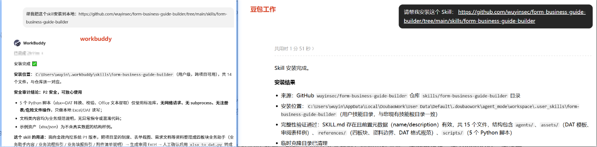
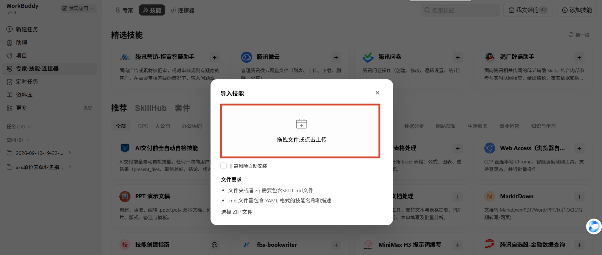
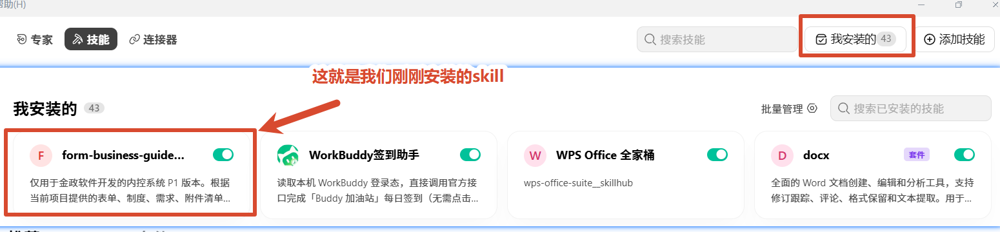
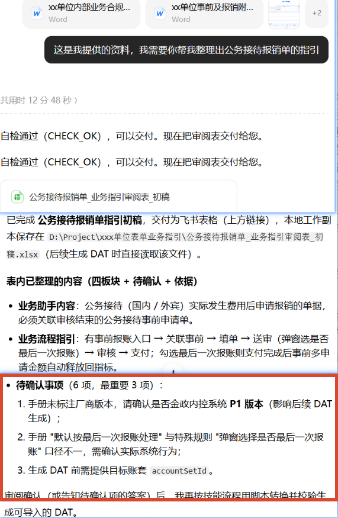
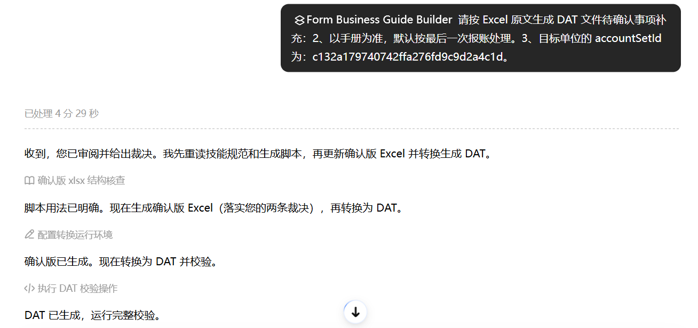
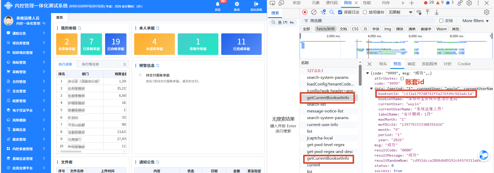

# 业务指引生成 Skill 及 DAT 编辑器

> 仅适用于金政软件开发的内控系统 P1 版本。本仓库包含两个工具：**业务指引生成 Skill**（安装到主流智能体，把项目资料整理成业务助手初稿并生成可导入的 DAT）和**业务助手 DAT 编辑器**（纯本地运行的 DAT 预览与修改工具）。Skill 通用于市面上的主流智能体；DAT 编辑器不限系统，只要有安装浏览器的电脑皆可使用。

---

## 目录

- [一、业务指引生成 Skill](#一业务指引生成-skill)
  - [1. 是什么](#1-是什么)
  - [2. 可以做什么](#2-可以做什么)
  - [3. 安装方法](#3-安装方法)
  - [4. 准备项目资料](#4-准备项目资料)
  - [5. 使用流程](#5-使用流程)
  - [6. 注意事项](#6-注意事项)
- [二、业务助手 DAT 编辑器](#二业务助手-dat-编辑器)
  - [1. 编辑器是什么](#1-编辑器是什么)
  - [2. 可以做什么](#2-可以做什么)
  - [3. 与系统内直接新建相比的优点](#3-与系统内直接新建相比的优点)
  - [4. 如何打开编辑器](#4-如何打开编辑器)
  - [5. 两种常见使用场景](#5-两种常见使用场景)
  - [6. 具体使用方法](#6-具体使用方法)
- [三、补充：获取内控系统 P1 账套 ID](#三补充获取内控系统-p1-账套-id)
- [仓库结构](#仓库结构)
- [使用原则](#使用原则)
- [环境要求](#环境要求)
- [数据安全](#数据安全)
- [许可证](#许可证)

---

## 一、业务指引生成 Skill

### 1. 是什么

业务指引生成 Skill 是一款安装在主流智能体（如 Codex、豆包工作、WorkBuddy 等）中的技能。使用时只需把对应项目资料发送给智能体并调用该技能，它会按内置规则整理业务助手的四个板块——业务助手内容、业务流程指引、业务填报指引和附件清单说明，生成一份 Excel 审阅初稿；确认无误后，再由它转换为可直接导入金政内控系统 P1 版本的 DAT 文件。整个过程无需和大模型沟通生成规范，全程方便快捷。

### 2. 可以做什么

- 读取表单截图、单位报账制度、附件清单、需求文档、操作手册等。
- 根据提供的资料整理业务助手内容、业务流程指引、业务填报指引和附件清单说明的内容。
- Skill 内置边界规则，资料未明确的内容列为待确认，不自行补充制度、金额、标准或其他内容。
- 生成 Excel 初稿，并根据确认后的 Excel 生成可直接导入系统的 DAT 文件。

### 3. 安装方法

#### 3.1 一句话安装

把下面内容发送给智能体：

```text
请帮我安装这个 Skill：
https://github.com/wuyinsec/form-business-guide-builder/tree/main/skills/form-business-guide-builder
```

Skill 地址：打开 [GitHub](https://github.com/wuyinsec/form-business-guide-builder)

下面是豆包工作和 WorkBuddy 的安装示例，其他通用智能体也是一样的。



#### 3.2 手动安装（以 Codex 为例）

1. 从 GitHub 下载项目并解压。
2. 打开 `skills` 文件夹，找到 `form-business-guide-builder`。
3. 将整个文件夹复制到以下目录：

   ```text
   C:\Users\你的用户名\.codex\skills\
   ```

4. 重新打开 Codex 或新建对话。

#### 3.3 其他智能体安装位置

| 智能体 | 安装位置或方式 |
| --- | --- |
| Codex | `%USERPROFILE%\.codex\skills\form-business-guide-builder` |
| Claude Code | `%USERPROFILE%\.claude\skills\form-business-guide-builder` |
| Zcode | `%USERPROFILE%\.zcode\skills\form-business-guide-builder` |
| WorkBuddy | 通过 专家.技能.连接器 → Skills 界面安装或导入 |

安装后，可在技能列表中选择该 Skill，或在对话框输入：

```text
/form-business-guide-builder
```

#### 3.4 WorkBuddy 安装

1. 打开 WorkBuddy，点击「专家.技能.连接器」，然后选「技能」。

   

2. 左上角「添加技能」，选择「上传技能」。

   

3. 将 `form-business-guide-builder.zip` 或 `form-business-guide-builder` 文件夹拖拽过来。
4. 安装完成后可在「我的安装列表」中看到，即表示安装成功。

   

### 4. 准备项目资料

建议至少提供以下资料：

- 对应表单截图；
- 单位财务提供的报销制度或者报销指引和附件清单；
- 需求文档、操作手册和审批流程图；
- 实施人员收集的特殊规则，例如上述资料里面未提及的信息；
- 需要导入 DAT 文件的 `accountSetId`（账套 ID）。

资料不完整也可以先整理初稿。`accountSetId` 在生成最终 DAT 时再提供。

### 5. 使用流程

#### 5.1 第一步：调用 Skill 整理初稿

在对话框里面输入 `/`，然后选择 **Form Business Guide Builder** 这个 Skill，表示接下来的对话需要使用这个技能。


把提供的资料拖动到对话窗口，然后发送：

```text
/form-business-guide-builder（这是示例，你要确保选到了该技能）
这是我提供的资料，我需要你帮我整理出 xxx、xxx……的指引（例如：公务用车事前申请单、差旅费报销单）。
```

对话示例如下：



Skill 会盘点已有资料、识别表单及项目规则、整理四板块文案、标注待确认事项，并生成审阅 Excel。

#### 5.2 第二步：审阅 Excel 初稿

1. 打开审阅表，逐张检查表单名称和四个业务助手板块。
2. 需要调整的内容直接在 Excel 中修改；如果需要补充资料再让智能体重新整理，就继续对话。
3. 资料中缺少的部分或者有冲突的会列出来，下一次对话时需要补充确认。
4. 资料确认完成后，可以继续下一步生成 DAT 文件。

#### 5.3 第三步：生成 DAT

上一环节生成的 Excel 初稿确定后，发送下面对话（请根据实际情况修改）：

```text
/form-business-guide-builder（这是示例，你要确保选到了该技能）
请按 Excel 原文生成 DAT 文件
待确认事项补充：
2、以手册为准，默认按最后一次报账处理。
3、目标单位的 accountSetId 为：账套Id。
```

对话示例如下：



最后可将生成后的 DAT 文件导入到系统业务助手配置的对应表单里面，或者使用业务助手 DAT 编辑器继续完善后再导入。

### 6. 注意事项

- Skill 里面已经内置边界规则，需确保提供的资料准确且是该单位的信息。
- 必须先审阅 Excel，再生成最终 DAT。
- DAT 导入失败时，先检查账套 ID 是否正确。

---

## 二、业务助手 DAT 编辑器

### 1. 编辑器是什么

业务助手 DAT 编辑器是一款本地运行的辅助工具，用于打开、预览、修改金政软件开发的内控系统 P1 版本业务指引的 DAT 文件。编辑内容只在当前浏览器页面中处理，不会上传到网络。

### 2. 可以做什么

- 打开并预览业务助手 DAT 文件。
- 修改目标单位的账套 ID。
- 编辑业务助手内容、业务流程指引、业务填报指引和附件清单说明。
- 调整文字格式、文字颜色、背景色和图片大小。
- 插入图片、GIF、链接和 HTML 代码。
- 修改完成后可直接在内控系统业务助手配置的对应表单进行导入。

### 3. 与系统内直接新建相比的优点

1. **本地预览**：可以先在本地修改和检查，不影响生产环境中的现有内容。
2. **支持 GIF**：可以插入 GIF 动图，系统原生编辑器暂不支持。
3. **支持 HTML**：可以通过 HTML 源码实现按钮跳转、特殊排版等效果，系统原生编辑器暂不支持。

### 4. 如何打开编辑器

1. 将 `business-assistant-editor` 压缩包完整解压到电脑。
2. 进入解压后的 `business-assistant-editor` 文件夹。
3. 双击 `index.html`，编辑器会在浏览器中打开；也可以直接双击「打开业务助手编辑器.bat」。

建议：使用 Edge 或 Chrome 浏览器，无需安装其他软件。

编辑器打开后的页面如下图所示：


### 5. 两种常见使用场景

#### 5.1 修改其他单位导出的 DAT 文件

从其他单位系统导出的 DAT 文件，可能因为账套 ID 与目标单位不一致，导入后无法正常使用或无法在列表中看到。

1. 点击「打开 DAT」，选择其他单位导出的 DAT 文件。
2. 填写目标单位正确的账套 ID。
3. 预览业务助手的四个板块，确认内容无误。
4. 点击「导出修改版 DAT」，再将新文件导入目标单位系统。

> 注意：账套 ID 必须填写正确，不能留空，也不能保留模板占位值。

#### 5.2 完善 Skill 生成的 DAT 文件

使用业务指引生成 Skill 生成 DAT 后，可以在编辑器中继续补充文字、图片、GIF、链接和排版。

1. 点击「打开 DAT」，选择 Skill 生成的文件。
2. 确认并填写目标单位正确的账套 ID。
3. 逐项检查并完善四个业务助手板块。
4. 确认显示效果后导出修改版 DAT，再导入业务系统。

### 6. 具体使用方法

#### 6.1 导入 DAT 文件

点击右上角「打开 DAT」，选择需要修改的 `.dat` 文件。载入成功后，页面会显示表单名称、表单 ID、账套 ID 和编辑状态。

#### 6.2 修改账套 ID

在页面顶部的「账套 ID」输入框中填写目标单位的账套 ID。从其他单位导出的 DAT 文件必须修改此项。

#### 6.3 编辑四个业务助手板块

通过左侧导航依次检查并编辑：

- 业务助手内容；
- 业务流程指引；
- 业务填报指引；
- 附件清单说明。

#### 6.4 设置文字格式

选中文字后，可以在工具栏设置标题、正文、加粗、斜体、下划线、文字颜色、背景色、对齐方式、项目符号和超链接。

#### 6.5 添加和调整图片

可以粘贴图片、拖入本地图片，或通过工具栏插入图片。点击图片后，可选择固定比例，也可以拖动图片四个角上的蓝色控制点调整大小，还可以替换或删除图片。GIF 动图的添加方式与普通图片相同。

#### 6.6 使用 HTML 代码

点击工具栏中的「</>」，可以查看或修改当前编辑区域的 HTML。该功能可用于添加按钮跳转和特殊样式。不了解 HTML 时，不要随意删除已有代码。


#### 6.7 导出前检查

- 账套 ID 是否正确；
- 表单名称和表单 ID 是否正确；
- 四个业务助手板块是否完整；
- 图片、GIF、链接和跳转按钮是否正常。

#### 6.8 导出 DAT 文件

确认无误后，点击「导出修改版 DAT」。浏览器会下载新的 DAT 文件，将该文件导入业务系统即可。

---

## 三、补充：获取内控系统 P1 账套 ID

以这个系统为例：按 `F12` 打开开发人员工具，然后刷新首页，找到类似 `getCurrentBooksetInfo` 的接口，点击「预览」，其中的 `booksetId` 就是账套 ID。



生成 DAT 时必须使用目标单位的账套 ID，不能留空、不能使用模板占位值，也不能沿用其他单位的值。

---

## 仓库结构

```text
form-business-guide-builder/                    # GitHub 仓库
├─ README.md                                    # 操作教程（本文件）
├─ LICENSE                                      # MIT 开源许可证
├─ CHANGELOG.md                                 # 版本更新记录
├─ .gitignore                                   # 排除业务资料和生成文件
├─ .github/                                     # GitHub 自动检查配置
├─ docs/
│  └─ images/                                   # 本教程使用的截图
├─ tools/business-assistant-editor/             # 纯本地 DAT 富文本编辑器
└─ skills/                                      # 可安装的 Skill
   └─ form-business-guide-builder/              # 表单业务指引生成工具
      ├─ SKILL.md                               # Skill 核心入口
      ├─ agents/                                # 显示名称和默认提示词
      ├─ references/                            # 资料边界、四板块及审校规范
      ├─ assets/                                # 脱敏审阅表示例
      └─ scripts/                               # Office、Excel 和 DAT 工具
```

`SKILL.md` 是智能体执行入口；`references` 保存资料边界、四板块及审校规范；`scripts` 提供确定性的 Office 提取、Excel→DAT 和校验能力；`assets/review-records.example.json` 和 `assets/review-example.xlsx` 是不含真实项目数据的结构示例。

## 使用原则

- 只使用当前项目资料、系统实际表现和用户明确确认的信息；
- 默认不联网补充规章制度，不引用其他单位或其他项目规则；
- 金额、比例、人数、时限、审批条件和必传附件必须有当前项目依据；
- 资料不明确时使用中性表述或列为待确认，不得猜测；
- DAT 只能根据用户确认后的 Excel 生成，转换时不得再次润色；
- 必须先审阅 Excel，再生成最终 DAT；
- DAT 导入失败时，先检查账套 ID 是否正确。

## 环境要求

- Python 3.10 或更高版本；
- 脚本仅使用 Python 标准库，无需安装第三方依赖；
- DAT 编辑器只需安装浏览器的电脑，使用 Edge 或 Chrome 即可，无需其他软件；
- 生成 DAT 前需确认使用金政内控系统 P1 版本，并由项目人员提供目标单位准确的 `accountSetId`；正常情况下无需提供 DAT 样例。

## 数据安全

- 编辑器为纯本地工具，文件不会上传到网络。
- 请勿向公开仓库提交单位制度原件、真实业务数据、账套信息、组织或用户信息、表单 ID、真实 DAT 和审阅结果。仓库中的示例均应保持脱敏。
- 原始资料、原始 DAT 和旧版本输出应保留，新版本输出到独立目录。

## 许可证

本项目使用 [MIT License](LICENSE)。
